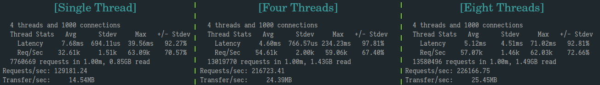

**A tiny network library**

This project is created for learning purpose.

A network library or server project is often very helpful for 
learning and practice, for the basic knowledge of network programming, operating system and programming language
can be integrated together, which is also the primary motivation of this project.

**The Model**

- NIO (Non-blocking IO) + one (event) loop per thread
- Reactor and event driven (implemented by linux epoll)

**Technical summary**

- RAII resources management
- Stream style log front-end,  which is implemented by {fmt} wrapper that guarantee the type safe
- Thread Local Storage (TLS) as cached data
- Asynchronous multi-thread log based on buffer swapping strategy
- Log file rolling strategy that consider both day time and log file size
- The "work-thread-transfer" strategy for transferring specific tasks among threads to avoid locking
- Efficient timer manager implemented by binary heap structure without redundant memorization
- Unified event source management by using timerfd and eventfd
- The different accept strategies of Acceptor
- The connection close strategy (TCP Half-close, passive close)
- The adjustment strategy of events of interest according to epoll working mode (avoid busy loop)
- More efficient IO Buffer space adjustment strategy to avoid allocating space frequently
- The idea of functional programming

**Rough performance tests**

The tests are conducted on a single PC with 4 cores: Intel(R) Core(TM) i7-6700 CPU @ 3.40GHz.

Some construction infos: Linux version 4.19.133-1-MANJARO (builduser@ba15) (gcc version 10.1.0 (GCC)).

Use optimized build (-O2).

- Log stream formatting (mean) time of various types in seconds, one million times

  |              |  int  |  double   | int64_t | void*  |
  | :----------: | :---: | :-------: | :-----: | :----: |
  |    printf    | 0.057 |   0.337   |  0.058  | 0.056  |
  | stringstream | 0.034 |   0.404   |  0.032  | 0.033  |
  |  muduo impl  | 0.011 |   0.339   |  0.011  | 0.007  |
  |  this impl   | 0.025 | **0.106** |  0.024  | 0.036* |

  (* in the last row: to match the format of void* type in muduo, the inner {fmt} pointer format is not used directly, thus the value 0.036 is not precise. It actually involves multiple formatting operations)

- Net library throughput performance test by [wrk](https://github.com/wg/wrk), test HTTP server, data is stored in memory

  |        |          CPU info of the machine          | Memory | Ethernet speed |          OS          |
  | :----: | :---------------------------------------: | :----: | :------------: | :------------------: |
  | Server | Intel(R) Core(TM) i7-7700HQ CPU @ 2.80GHz |  16GB  |  1000 Mbit/s   | Manjaro 20.0.3 Lysia |
  | Client |  Intel(R) Core(TM) i7-6700 CPU @ 3.40GHz  |  8GB   |  1000 Mbit/s   | Manjaro 20.0.3 Lysia |

  Test configurations:

  `wrk -H "Connection: Close" -t4 -c1000 -d60s` (for short connection)

  `wrk -t4 -c1000 -d60s` (for long connection)

  

**Main references:**

- [Muduo](https://github.com/chenshuo/muduo) network library
- [Book series written by W. Richard Stevens](http://www.kohala.com/start/#books)
- [The Linux Programming Interface (TLPI)](https://man7.org/tlpi/) written by Michael Kerrisk
